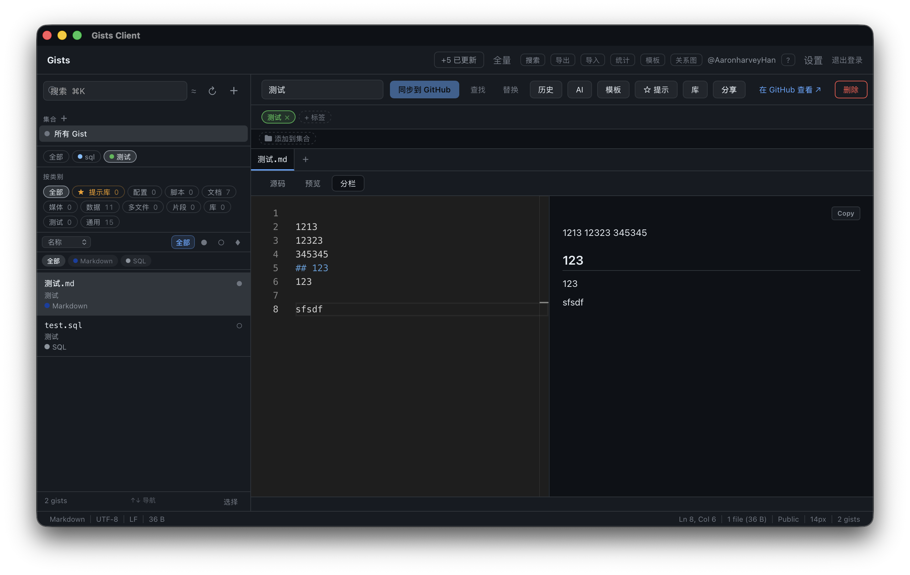
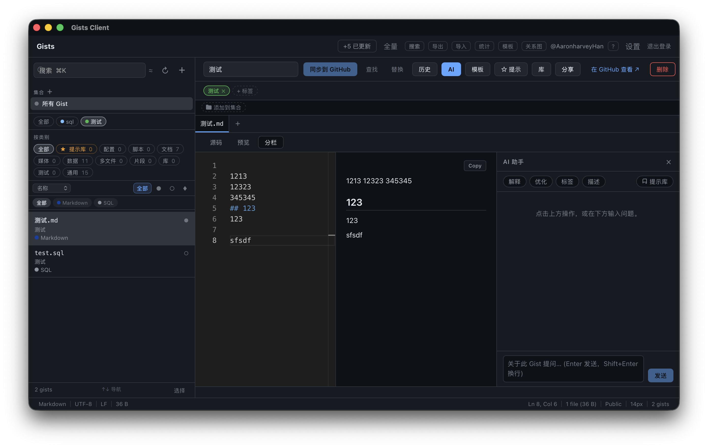
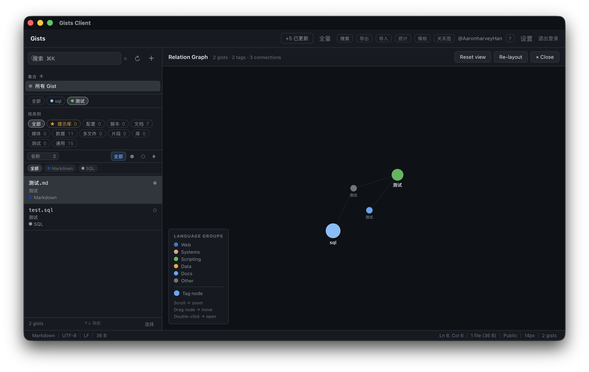
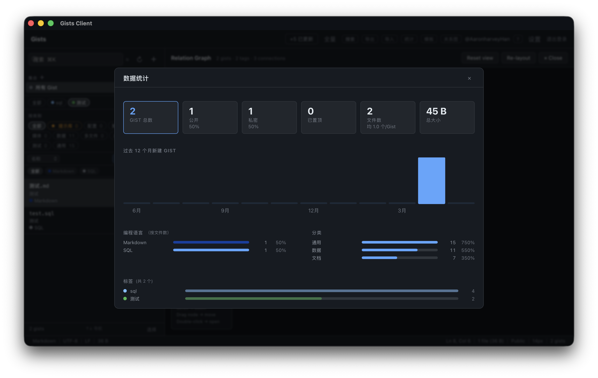

# Gists Client · v0.3

**本地优先的代码片段工作台。** 离线全文搜索 · Monaco 编辑器 · AI 对话 · 代码执行 · 版本历史 · 多账号 · 无订阅费。

基于 GitHub Gist 存储，数据完全本地化（SQLite），无任何系统级依赖（含 git）。

<!-- SCREENSHOT: 主界面全貌（深色主题，侧边栏 + 编辑器 + AI 面板同时展开）
     上传到 Issue 后，将下方 URL 替换为实际链接 -->


---

## 为什么不用 GitHub 网页 / 现有客户端？

| | Gists Client | GitHub 网页 | Lepton |
|---|---|---|---|
| 离线使用 | ✓ | ✗ | 部分 |
| 本地全文搜索 | ✓ FTS5 | ✗ | ✗ |
| AI 对话（自带模型） | ✓ | ✗ | ✗ |
| 代码执行 + 历史归档 | ✓ 11 种语言 | ✗ | ✗ |
| 版本历史 + diff | ✓ | ✓（需联网）| ✗ |
| 三路合并冲突解决 | ✓ | ✗ | ✗ |
| 多 GitHub 账号切换 | ✓ | ✗ | ✗ |
| 本地草稿（不发布）| ✓ | ✗ | ✗ |
| 自定义标签 + 分类 | ✓ | ✗ | 部分 |
| 关系图可视化 | ✓ | ✗ | ✗ |
| 订阅费 | 免费 | 免费 | 免费 |
| 数据存储位置 | 本地 SQLite | GitHub 服务器 | GitHub 服务器 |

---

## 目录

- [快速开始](#快速开始)
- [功能概览](#功能概览)
- [使用教程](#使用教程)
  - [界面概览](#界面概览)
  - [首次设置](#首次设置)
  - [多账号管理](#多账号管理)
  - [浏览与导航](#浏览与导航)
  - [搜索与过滤](#搜索与过滤)
  - [新建与编辑](#新建与编辑)
  - [多文件标签页](#多文件标签页)
  - [Markdown 编辑](#markdown-编辑)
  - [标签与分类](#标签与分类)
  - [批量操作](#批量操作)
  - [版本历史浏览器](#版本历史浏览器)
  - [本地草稿与离线优先](#本地草稿与离线优先)
  - [模板系统](#模板系统)
  - [代码运行与历史](#代码运行与历史)
  - [AI 助手](#ai-助手)
  - [国际化（中英双语）](#国际化中英双语)
  - [关系图视图](#关系图视图)
  - [分享与嵌入](#分享与嵌入)
  - [命令面板](#命令面板)
  - [全局快速搜索](#全局快速搜索)
  - [命令行工具 gist](#命令行工具-gist)
  - [系统托盘](#系统托盘)
  - [统计面板](#统计面板)
  - [导出与导入](#导出与导入)
  - [专注模式与 Vim 模式](#专注模式与-vim-模式)
  - [隐私与崩溃报告](#隐私与崩溃报告)
  - [快捷键速查](#快捷键速查)
- [技术参考](#技术参考)

---

## 快速开始

### 直接下载（推荐）

前往 [Releases 页面](https://github.com/AaronharveyHan/gists_client/releases/latest) 下载对应平台的安装包：

| 平台 | 文件 |
|------|------|
| macOS | `.dmg` |
| Windows | `.msi`（推荐）或 `.exe` |
| Linux | `.AppImage`（推荐，免安装）或 `.deb` |

> **macOS**：首次打开若提示"无法验证开发者"，右键 → 打开 即可。  
> **Windows**：SmartScreen 警告点"仍要运行"即可。  
> **Linux**：`.AppImage` 下载后 `chmod +x *.AppImage` 即可运行；`.deb` 适用于 Debian / Ubuntu。

### 从源码构建

### 前置要求

- [Rust 1.77+](https://rustup.rs/)
- [Node.js 18+](https://nodejs.org/)
- [Tauri v2 系统依赖](https://v2.tauri.app/start/prerequisites/)（macOS / Windows 通常无需额外安装；Linux 需 WebKitGTK 4.1 / libsoup-3 等）

### 安装 & 运行

```bash
npm install
npm run tauri dev
```

### 生产构建

```bash
npm run tauri build
```

---

## 功能概览

| 功能模块 | 亮点 |
|----------|------|
| **编辑器** | Monaco（VS Code 同款）· 多文件标签页 · 自动草稿保存 · 冲突检测 · 三路合并 |
| **搜索** | FTS5 全文搜索 · `tag:` `lang:` `is:` 结构化过滤 · 跨 gist 内容搜索 |
| **同步** | ETag 增量同步 · 三路合并自动解决冲突 · 速率限制退避 |
| **版本历史** | GitHub Commits 时间线 · diff 展开 · 一键 Restore |
| **本地草稿** | 离线创建 gist · 联网后一键发布到 GitHub |
| **模板系统** | 保存/管理模板 · 从模板新建 gist |
| **代码运行** | 在编辑器内执行代码 · 流式输出 · 历史归档 · 输出对比 · 支持 11 种语言 |
| **多账号** | 命名 GitHub 账号（工作/个人）· OS 密钥链独立存储 · 工具栏头像一键切换 |
| **AI 助手** | 流式 AI 对话 · Explain / Optimize / Tags / Describe 快捷指令 · 对话历史持久化 · 导出对话为草稿 |
| **国际化** | 中 / 英双语界面 · 设置中一键切换 · 默认中文 |
| **关系图** | 力导向图展示 gist ↔ 标签关系 · 拖拽 · 缩放 · 悬停详情 |
| **分享** | GitHub URL · HTML 嵌入 · Markdown 链接 · 原始文件 URL |
| **标签 / 分类** | 自定义彩色标签 · 启发式 10 类自动分类 |
| **批量操作** | 多选 · 批量打标签 · 批量删除 · 批量导出 |
| **全局搜索** | `Alt+Space` 浮动搜索窗口 · 系统托盘常驻 |
| **命令行工具** | `gist save foo.py` · `list` · `search` · `view` · 与桌面端共享同一数据库 |
| **统计** | 语言 / 分类 / 标签 / 月度活动可视化 |
| **主题** | 跟随系统深浅色 · 多套 Monaco 主题 · Vim 模式 · 专注模式 |
| **隐私** | 可选匿名崩溃报告（Sentry）· 本地 PII 脱敏 · 默认关闭 |

## 功能截图

<!-- SCREENSHOT: AI 对话面板（流式输出 + 快捷指令）
     建议用 GIF 录制 AI 流式回复的动态效果 -->


<!-- SCREENSHOT: 关系图视图（多节点，拖拽中状态）-->


<!-- SCREENSHOT: 统计面板（语言分布 + 月度活动图）-->


---

## 使用教程

### 界面概览

```
┌─────────────────────────────────────────────────────────────────────────┐
│  工具栏  Sync · Full · Search · Export · Import · Stats · Templates ··  │
├──────────────────┬──────────────────────────────────────────────────────┤
│                  │  描述输入栏     [同步到GitHub][History][AI][Share]··  │
│  搜索框  ↻  ＋  │  标签行                                              │
│  标签过滤        │  文件标签页  [file1.ts] [file2.md ×] [+]            │
│  分类过滤        ├──────────────────────────────────────────────────────┤
│  排序 · 可见性   │                                                      │
│  语言 chips      │        Monaco 编辑器 / Markdown 预览                │
│  ──────────────  │                                                      │
│  gist 列表       │    （History / AI / Run 面板可在右侧展开）           │
│  （右键菜单）    │                                                      │
│                  │                                                      │
│  [Select]  N gists                                                      │
├──────────────────┴──────────────────────────────────────────────────────┤
│  状态栏  语言 · UTF-8 · LF · 大小 · Ln/Col · 选区 · 文件数             │
└─────────────────────────────────────────────────────────────────────────┘
```

---

### 首次设置

首次启动时会出现四步引导向导：

| 步骤 | 内容 |
|------|------|
| **欢迎** | 应用简介与核心功能亮点 |
| **Token** | 输入 GitHub Personal Access Token |
| **同步** | 首次全量拉取进度展示 |
| **完成** | 显示常用快捷键，进入主界面 |

#### 生成 Token

1. 前往 GitHub → **Settings → Developer settings → Personal access tokens → Fine-grained tokens**（或 Classic tokens）。
2. 勾选 **Gists** 读写权限，生成 token。
3. 将 token 粘贴到向导输入框，点击 **Connect**。
   - 应用立即调用 `GET /user` 验证有效性，成功后 token 存入 OS 密钥链。
4. 验证通过后自动开始首次全量同步。

> Token 格式：必须以 `ghp_` / `ghu_` / `gho_` / `ghs_` / `github_pat_` 开头，长度 ≥ 20。

#### 关于系统钥匙串授权（重要）

**首次保存 Token 时，macOS 会弹出系统对话框：「gists-client 想使用您存储在钥匙串『github_token』中的机密信息」**——这是正常行为，请点击 **始终允许**，之后不会再次询问。Windows 用 Credential Manager、Linux 用 Secret Service，机制相同但通常无需手动确认。

| 项目 | 说明 |
|------|------|
| **为什么需要？** | 用系统钥匙串加密存储你的 GitHub Token（macOS Keychain / Windows Credential Manager / Linux keyutils），避免明文落盘 |
| **存了什么？** | 仅一个键值对：`com.gists-client.app` → `github_token` = 你的 PAT |
| **谁能读到？** | 只有 gists-client 本身。其他应用要读取需要单独获得系统授权 |
| **拒绝授权会怎样？** | 应用静默降级，把 token 存到本地 SQLite（明文）。功能不受影响，但安全性较低 |
| **如何撤销？** | macOS：钥匙串访问.app → 搜索 `com.gists-client.app` 删除即可 |

> 纯本地模式（首屏「跳过登录」）不会触发任何钥匙串请求——完全离线使用。

---

### 多账号管理

工具栏右侧的头像/账号名下拉菜单，或 **Settings → Accounts** 标签页均可管理账号。

#### 添加账号

**Settings → Accounts → Add account**：输入名称（如「Work」「Personal」）和对应 GitHub PAT，点击 **Add**。系统自动验证 token 并从 `GET /user` 获取登录名和头像，每个 token 独立存入 OS 密钥链。

#### 切换账号

点击工具栏头像下拉菜单中的任意账号条目，即时切换；或在 **Settings → Accounts** 点击 **Switch**。切换后，所有后续同步/推送均使用新账号的 token。

#### 移除账号

**Settings → Accounts** 每行的 **✕** 按钮。至少保留一个账号——无法删除最后一个。

> 首次启动时，旧版单 token 自动迁移为名为「Personal」的账号，无需手动操作。

---

### 浏览与导航

#### 侧边栏

| 操作 | 说明 |
|------|------|
| 点击 gist | 在编辑器中打开 |
| `↑` / `↓` | 在列表中上下导航（非输入焦点时） |
| `⌘K` | 聚焦搜索框 |
| `⌘R` | 增量同步（仅拉取变更） |
| 工具栏 **Full** | 强制全量重新拉取所有 gist |
| 右键 gist | 上下文菜单：固定/取消固定、在新标签页打开、切换到已开标签页、复制链接、在浏览器打开、选中、删除 |

#### 固定置顶

点击 gist 右侧的 **♦** 图标（或右键 → Pin to top）可将 gist 固定在列表顶部，再次点击取消。

#### 多 Gist 标签页

右键 gist → **在新标签页打开**，可同时打开多个 gist 进行对比或并行编辑：

- 编辑器顶部出现标签栏，显示所有已开 gist 的描述/文件名。
- 点击标签切换当前 gist；点击 **×** 关闭。
- 若某 gist 已在标签页中，右键菜单变为 **切换到标签页**。

#### 可拖拽侧边栏

拖拽侧边栏与编辑器之间的分隔线可调整宽度（180 px – 600 px），宽度自动持久化。

---

### 搜索与过滤

#### 全文搜索（侧边栏搜索框）

基于 SQLite FTS5 BM25 排名，搜索范围：描述 + 文件名 + 文件内容。

| 语法 | 示例 | 含义 |
|------|------|------|
| 关键词 | `async rust` | 全文匹配 |
| `tag:` | `tag:work` | 按标签名过滤 |
| `lang:` | `lang:python` | 按文件语言过滤 |
| `is:` | `is:public` / `is:secret` | 按可见性过滤 |
| 组合 | `tag:notes lang:md is:secret` | 多条件 AND |

#### 全内容搜索（`⌘⇧F`）

跨所有 gist 的文件内容逐行搜索（含未打开的 gist），结果按文件分组显示匹配行。点击结果行可直接跳转到对应 gist。

#### 标签过滤

侧边栏上方的标签 chips：点击某标签只显示贴了该标签的 gist，再次点击取消。

#### 分类过滤

点击分类 chip（Config / Script / Docs / Multi-file / Snippet …）过滤自动归类结果。

#### 快速可见性 / 语言过滤

| Chip | 含义 |
|------|------|
| **All** | 显示全部 |
| **●** | 仅 Public gist |
| **○** | 仅 Secret gist |
| **♦** | 仅 Pinned gist |

语言 chips 行（仅在当前列表含 ≥ 2 种语言时显示）：点击某语言仅显示包含该语言文件的 gist。

#### 排序

| 选项 | 说明 |
|------|------|
| Last updated | 按最后更新时间降序（默认） |
| Date created | 按创建时间降序 |
| Name | 按第一个文件名字母序 |
| File count | 按文件数量降序 |

---

### 新建与编辑

#### 新建 Gist

- 点击侧边栏 **＋** 按钮，或按 `⌘N`。
- 填写描述、文件名、内容，选择 Public / Secret，点击 **Create**。
- 若当前离线，点击 **Save Draft** 创建本地草稿（见[本地草稿与离线优先](#本地草稿与离线优先)）。

#### 编辑

1. 在编辑器中修改内容或描述。
2. 修改后 **1.5 秒**自动写入本地 SQLite（标题栏显示 **●** 待保存指示器）。
3. 保存完成后显示 **↑**（本地已保存，未推送到 GitHub）。
4. 点击 **同步到 GitHub** 将草稿 PATCH 到 GitHub，产生新版本。

#### 冲突处理

后台同步检测到正在编辑的 gist 有远端更新时，应用自动尝试**三路合并**（base→local vs base→remote）：

- **无冲突**：非重叠改动自动合并，静默应用，无需人工干预。
- **有冲突**：在冲突文件内注入 Git 冲突标记，并弹出冲突横幅，显示每个冲突文件的 chip：
  - 直接在编辑器内解决 `<<<<<<< Local` / `=======` / `>>>>>>> Remote` 冲突标记（行内红/蓝 Monaco 高亮）。
  - 所有冲突解决后，**Conflicts resolved ✓** 按钮变为可点击状态，确认后推送合并结果。
  - **Discard mine** — 放弃本地改动，完全采用远端版本。

#### Find & Replace

- `⌘F` — 打开编辑器内查找框。
- `⌘H` — 打开查找并替换框。
- 也可点击工具栏的 **Find** / **Replace** 按钮。

---

### 多文件标签页

| 操作 | 说明 |
|------|------|
| 点击标签 | 切换到该文件 |
| **+** 按钮 | 新增文件（立即进入文件名编辑状态） |
| 双击标签 | 内联重命名文件 |
| 中键点击标签 | 关闭该文件（≥ 2 文件时） |
| 拖拽标签 | 拖到另一标签上重新排序 |
| 右键标签 | 上下文菜单：Rename / Close / Close Others / Close to the Right |
| `Alt+[` | 切换到上一个文件 |
| `Alt+]` | 切换到下一个文件 |

---

### Markdown 编辑

当活跃文件为 `.md` 后缀时，编辑器上方出现三模式切换：

| 模式 | 说明 |
|------|------|
| **源码** | 纯 Monaco 编辑器 |
| **预览** | 渲染后的 Markdown（GFM 表格、任务列表、Mermaid 图表） |
| **分栏** | 左侧编辑，右侧实时预览（默认） |

预览区每个代码块右上角有 **Copy** 按钮，顶部有 **Copy All** 按钮（复制全文）。Mermaid 图表懒加载：滚动进入视口时渲染 SVG。

---

### 标签与分类

#### 标签（用户自定义）

- 编辑器中，描述输入栏下方为标签行：点击 **＋** 选择已有标签或输入新标签名创建。
- 新标签自动分配颜色，也可点击色块修改。
- 侧边栏标签 chips 可单标签过滤 gist 列表。

#### 分类（自动归类）

启动时自动根据文件扩展名和内容归类，共 10 种：

`Config` · `Script` · `Docs` · `Media` · `Data` · `Multi-file` · `Snippet` · `Library` · `Test` · `General`

用户可在设置中锁定自定义分类，防止被自动覆盖。

---

### 批量操作

1. 点击侧边栏底部 **Select** 按钮进入多选模式，或右键 gist → Select。
2. 点击 gist 条目勾选/取消勾选，或点击 **Select all N** 一键全选。
3. 底部 BulkActionBar 显示已选数量和可用操作：

| 操作 | 说明 |
|------|------|
| **+ Tag** | 为所有选中 gist 添加标签 |
| **标签 ×** | 移除所有选中 gist 共有的标签 |
| **Export** | 将选中 gist（含文件内容）导出为 JSON |
| **Delete N** | 删除选中的 N 个 gist（确认后依次执行） |
| **Clear** | 取消所有选中，退出多选模式 |

---

### 版本历史浏览器

点击编辑器工具栏 **History** 按钮（或按 `⌘⇧H`）在右侧展开历史面板。

#### Revisions 标签页

列出该 gist 在 GitHub 上的所有提交，每行显示 SHA、作者、相对时间、文件变更数和增删行数。**点击某个版本** 展开该次提交的 unified diff（首次加载，后续缓存）。**Restore to this version** 从 GitHub 拉取该 SHA 的完整文件内容，加载到编辑器（标记为待保存状态，可审查后再推送）。

#### Working tree 标签页

显示当前编辑器内容与最后一次 GitHub 同步快照的 diff（纯本地计算，无需网络）。

---

### 本地草稿与离线优先

离线或不想立即发布到 GitHub 时，可创建**本地草稿**：

- 新建对话框中点击 **Save Draft**（或直接离线时 Create 自动降级）。
- 本地草稿仅存储在 SQLite，侧边栏显示 **Draft** 标记，编辑器顶部显示草稿横幅。
- 联网后点击编辑器工具栏的 **Publish to GitHub** 一键发布，草稿 ID 迁移为真实 GitHub ID。
- 网络恢复时应用自动提示有 N 个本地草稿待发布。

---

### 模板系统

将常用代码结构保存为模板，快速脚手架新 gist。

#### 访问模板管理器

工具栏 **Templates** 按钮打开模板列表。

#### 模板列表

- 每张卡片展示模板名称、描述、文件数、可见性和文件名预览。
- **Use** — 以该模板为基础打开新建 Gist 对话框（预填充所有文件内容）。
- **Edit** — 进入多文件编辑表单（支持添加/删除/重命名文件、修改描述和可见性）。
- **Delete** — 二次确认后删除。

#### 从当前 Gist 保存模板

编辑器工具栏 **Template** 按钮（或 `⌘⇧T`）→ 输入模板名 → **Save**，将当前 gist 的所有文件克隆为新模板。

---

### 代码运行与历史

在编辑器中直接执行当前文件，无需离开应用。每次执行结果自动归档到 SQLite，便于追踪输出变化。

#### 支持语言

`Python` · `JavaScript` · `TypeScript`（via ts-node）· `Shell / Bash / Zsh` · `Ruby` · `PHP` · `Go` · `MJS` · `CJS`

#### 基本使用

- 当活跃文件为可执行扩展名时，编辑器工具栏出现 **▶ Run** 按钮。
- 点击 **▶ Run**（或按 `⌘⇧E`）在编辑器底部展开运行面板。
- 输出实时流式显示：stdout 为浅灰，stderr 为红色。
- 运行完成后显示执行耗时和退出码，例如 `Finished in 0.42s · exit 0`。
- 状态徽章：`Running`（动画）→ `Exit 0`（绿色）/ `Exit N`（红色）/ `Killed` / `Timed out`。
- **Stop** 按钮发送 kill 信号终止运行；**Clear** 清空输出；**×** 关闭面板。
- 执行超时上限：**30 秒**，超时后自动终止。

> 代码写入临时目录（`$TMPDIR/gists-run-{id}/`）执行，完成后自动清理。

#### 输出对比（vs last run）

每次运行结果（stdout / stderr，各限 100 KB）自动写入本地 `run_history` 表，每个文件最多保留最近 **50** 条记录。

运行完成后，若该文件有 ≥ 2 条历史记录，面板顶部出现 **vs last run** 按钮：

- 点击后在输出区下方展开 unified diff，对比本次 stdout 与上次 stdout 的差异（绿色 = 新增，红色 = 删除）。
- 再次点击 **Hide diff** 收起。

#### 执行历史抽屉

运行面板底部显示可折叠的 **▾ Run history (N)** 抽屉：

- 列出每条历史：相对时间 · 退出码徽章 · 执行耗时。
- 点击任意历史条目，在输出区预览该次运行的 stdout，顶部显示 **✕ Back to current** 返回按钮。

---

### AI 助手

编辑器工具栏 **AI** 按钮（或 `⌘⇧A`）在右侧展开 AI 对话面板。

#### 配置

工具栏 **Settings** → AI 标签页：

| 字段 | 说明 |
|------|------|
| **API Base URL** | 兼容 OpenAI 协议的端点，例如 `https://dashscope.aliyuncs.com/compatible-mode/v1` 或任意自建服务 |
| **API Key** | 对应服务的密钥 |
| **Model** | 模型名称（如 `qwen-coder-plus`、`gpt-4o`） |

#### 快捷指令

面板顶部四个一键指令，自动将当前文件内容作为上下文发送：

| 指令 | 功能 |
|------|------|
| **Explain** | 用简洁易懂的语言解释代码含义 |
| **Optimize** | 审查代码并给出可读性、性能和最佳实践改进建议 |
| **Tags** | 建议 3–5 个分类标签（可一键 **Apply** 直接打到当前 gist） |
| **Description** | 生成一行简洁描述（可一键 **Apply** 更新描述字段） |

#### 自由对话

底部输入框可自由提问，`Enter` 发送（`Shift+Enter` 换行），AI 响应流式显示。

#### 对话历史持久化

每个 gist 的对话记录自动保存到 `localStorage`，重启应用后恢复：

- 切换 gist 时面板自动加载该 gist 的历史对话。
- 最多保留 **20 个** gist 的历史，每个 gist 最多 **60 条**消息（FIFO 淘汰）。

#### 面板操作按钮（对话存在时显示）

| 按钮 | 功能 |
|------|------|
| **导出** | 将当前对话格式化为 Markdown，保存为本地草稿 gist，自动在侧边栏中打开 |
| **清空** | 确认后清除当前 gist 的全部对话记录 |

---

### 国际化（中英双语）

应用界面支持中文和英文，默认使用中文。

#### 切换语言

工具栏 **Settings** → 顶部语言切换：选择 **中文** 或 **English**，界面即时切换，无需重启。偏好设置存入 `localStorage`，下次启动自动恢复。

#### 覆盖范围

| 命名空间 | 覆盖组件 |
|----------|----------|
| `common` | 通用操作按钮（保存、取消、删除…） |
| `toolbar` | 工具栏所有按钮与同步状态提示 |
| `sidebar` | 侧边栏搜索、排序、分类、标签操作 |
| `editor` | 新建对话框、冲突横幅、草稿横幅、三路合并横幅 |
| `ai` | AI 面板快捷指令、导出/清空按钮 |
| `stats` | 统计面板所有标签与月份格式 |
| `onboarding` | 引导向导全部步骤文案（含隐私同意） |
| `settings` | 设置弹窗各项标签（含账号、隐私） |
| `runner` | 运行面板耗时、退出码、历史、对比文案 |

---

### 关系图视图

工具栏 **Graph** 按钮打开力导向关系图，可视化所有 gist 与标签的关联关系。

- **节点**：小圆 = gist（颜色按语言组）；大圆 = 标签（颜色按标签色）；标签节点大小随关联 gist 数量缩放。
- **边**：gist 被打上某标签时产生一条连线。
- **物理模拟**：自定义 Euler 积分力学（斥力 + 弹力 + 重力 + 阻尼），450 帧后自动冷却。

| 交互 | 说明 |
|------|------|
| 滚轮 | 缩放视图（0.08× – 8×） |
| 拖拽节点 | 移动节点位置，重新激活模拟 |
| 拖拽背景 | 平移画布 |
| 悬停节点 | 显示名称 / 语言 / 双击提示浮层，高亮相邻节点并淡化其余 |
| 单击节点 | 选中高亮 |
| 双击 gist 节点 | 关闭图视图并在编辑器中打开该 gist |
| **Reset view** | 恢复初始缩放和平移 |
| **Re-layout** | 随机重置节点位置，重新模拟 |

右下角图例面板显示语言组配色说明和操作提示。

---

### 分享与嵌入

编辑器工具栏 **Share** 按钮（或 `⌘⇧S`）打开分享面板。

| 格式 | 内容 | 适用场景 |
|------|------|----------|
| **GitHub URL** | `https://gist.github.com/…` | 分享链接，附带「Open ↗」浏览器直开按钮 |
| **HTML 嵌入** | `<script src="….js"></script>` | 嵌入博客 / 网页，自动渲染带语法高亮的 gist |
| **Markdown 链接** | `[描述](url)` | README / 文档中引用 |
| **原始文件 URL** | 每个文件的 raw 地址 | 直接访问文件内容、`curl` 获取脚本等 |

每行均有一键 **Copy** 按钮，点击后按钮短暂变绿提示复制成功。本地草稿（未发布到 GitHub）显示提示，而非分享选项。

---

### 命令面板

按 `⌘P` 打开命令面板（快速跳转）：

- **空查询**：顶部显示「最近访问」（最多 8 条）+ 完整 gist 列表。
- **输入关键词**：模糊搜索所有 gist（最近访问的结果有优先权加分）。
- `↑` / `↓` 上下移动，`Enter` 跳转，`Esc` 关闭。

---

### 全局快速搜索

按 **`Alt+Space`**（任何应用、任何窗口均可触发）弹出浮动快速搜索窗口：

- 输入关键词实时过滤所有 gist（描述 + 文件名 + 语言 + 标签）。
- 点击某条结果 → 主窗口自动聚焦并打开对应 gist。
- 结果行显示语言色点、描述、文件名和文件数。
- `Esc` 或点击窗口外关闭。

> 浮动窗口为无边框、始终置顶样式，不出现在任务栏。

---

### 命令行工具 gist

为「在终端里写代码」的人准备的命令行入口。`gist` 与桌面端**共享同一个 SQLite 数据库和系统钥匙串**——终端保存的片段会立刻出现在 App 里，反之亦然。

#### 安装

**方式一：直接下载（推荐）** —— 每个 [Release](https://github.com/AaronharveyHan/gists_client/releases/latest) 都附带预编译的 CLI：

```bash
# macOS (Apple Silicon) / Linux (x86_64) 示例
chmod +x gist-macos-arm64           # 或 gist-linux-x86_64
mv gist-macos-arm64 /usr/local/bin/gist
# Windows：把 gist-windows-x86_64.exe 改名为 gist.exe 放进 PATH
```

**方式二：从源码构建**

```bash
# 在项目根目录
cargo build --release --features cli --bin gist
cp src-tauri/target/release/gist /usr/local/bin/   # macOS / Linux
```

> CLI 用 `cli` feature 单独开启，因此 `cargo tauri build`（桌面端打包）不会编译它，桌面包体不受影响。发布工作流会在三平台上单独编译并把二进制上传到 Release。

#### 命令一览

| 命令 | 说明 |
|------|------|
| `gist save <file>...` | 从一个或多个文件创建 gist（已登录则推送到 GitHub，否则存为本地草稿） |
| `gist save -` | 从 stdin 读取内容（`--name` 指定文件名） |
| `gist list [-n N] [--all]` | 列出最近的 gist（默认 20 条） |
| `gist search <query>` | 全文搜索（支持 `tag:` `lang:` `is:` 语法） |
| `gist view <id>` | 把 gist 的文件内容打印到 stdout |
| `gist open <id>` | 在浏览器打开 gist |
| `gist whoami` | 显示当前登录的 GitHub 账号 |

**`save` 标志：** `-p/--public`（默认 secret）· `-d/--desc <文本>` · `-l/--local`（仅存本地草稿）· `--name <文件名>`（stdin 用）

#### 示例

```bash
gist save foo.py                              # 推送一个 secret gist
gist save foo.py bar.js -p -d "two snippets"  # 多文件 + public + 描述
cat notes.md | gist save - --name notes.md    # 从管道保存
gist list -n 5
gist search "tag:work lang:python"
gist view 1a2b3c                              # id 支持前缀匹配
```

> `<id>` 接受前缀匹配——从 `gist list` 复制前几位即可，无需完整 32 位 id。

#### Raycast / Alfred 集成

CLI 的 `--json` 输出（`save` / `list` / `search`）让 macOS 启动器可以直接接入。启动器不直接碰数据库，全部走 `gist` CLI——所以鉴权、token、数据路径都和桌面端完全一致，**读写同一个 SQLite**：

```
Raycast / Alfred  ──►  gist --json  ──►  同一个 SQLite  ◄──  桌面 App
```

两个扩展都会自动探测 `gist` 二进制（`/opt/homebrew/bin`、`/usr/local/bin`、`~/.cargo/bin`），也支持手动指定路径。详见 [`extensions/`](extensions/)。

**Raycast**（`extensions/raycast/`，完整 TypeScript 扩展）

| 命令 | 说明 |
|------|------|
| **Search Gists** | 边输边搜（支持 `tag:` `lang:` `is:`）；`↵` 浏览器打开 · `⌘C` 复制内容 · `⌘.` 复制 URL |
| **Create Gist from Clipboard** | 把剪贴板内容存成 gist，成功后复制 URL |

```bash
cd extensions/raycast
npm install
npm run dev      # ray develop —— 立即出现在 Raycast 中
```

**Alfred**（`extensions/alfred/`，需 Powerpack）

Script Filter 脚本 `gist-search.sh` 调用 `gist ... --json`，再由 `to_alfred.py` 转换成 Alfred item 格式。由于 `.alfredworkflow` 无法以纯文本提交到 git，按 [`extensions/alfred/README.md`](extensions/alfred/) 的分步说明接入工作流即可（约 2 分钟）：`gist <query>` 边输边搜，`↵` 打开、`⌘C` 复制 URL。

> 两个扩展都依赖先构建好 `gist` CLI（见上方「构建与安装」）。未登录时 `Create Gist` 会存为本地草稿。

---

### 系统托盘

应用最小化时驻留系统托盘，主窗口关闭按钮不退出应用而是隐藏到托盘。

| 托盘操作 | 说明 |
|----------|------|
| 左键点击图标 | 切换主窗口显示/隐藏 |
| **Show Gists Client** | 显示并聚焦主窗口 |
| **Quick Search (Alt+Space)** | 弹出快速搜索浮窗 |
| **Quit** | 完全退出应用 |

---

### 统计面板

点击工具栏 **Stats** 按钮打开统计面板：

| 卡片 | 内容 |
|------|------|
| Total / Public / Secret / Pinned | 数量与占比 |
| Files / Total Size | 文件总数、平均文件数、磁盘大小 |
| 活动时间线 | 过去 12 个月每月新建 gist 数量（SVG 柱状图） |
| 语言分布 | 前 10 种语言文件数占比（带语言专属色条） |
| 分类分布 | 各自动分类数量占比 |
| 标签分布 | 前 10 个标签使用频次（带颜色色条） |

---

### 导出与导入

#### 导出全部

工具栏 **Export** → 选择保存路径 → 将所有 gist（含标签、固定状态、分类）导出为单个 JSON 文件。

#### 导出选中

进入多选模式 → 选中若干 gist → BulkActionBar **Export** → 仅导出选中 gist。

#### 导入

工具栏 **Import** → 选择备份 JSON → 进入导入预览页：

- 列表显示每条 gist 的状态（`new` / `exists`）。
- 可逐条勾选或全选，点击 **Import Selected** 执行导入。
- 导入仅写入本地 DB，不会自动推送到 GitHub。

---

### 专注模式与 Vim 模式

#### 专注模式（Zen Mode）

按 `⌘\` 或在设置中开启：隐藏工具栏、侧边栏、状态栏，编辑区铺满，最大化写作沉浸感。再按 `⌘\` 退出。

#### Vim 模式

在设置中勾选 **Vim mode**，Monaco 编辑器切换为 Vim 键位。状态栏底部显示当前 Vim 模式（Normal / Insert / Visual）。

---

### 隐私与崩溃报告

**Settings → Privacy** 中可开启可选的匿名崩溃报告（由 Sentry 托管）：

| 项目 | 说明 |
|------|------|
| **默认状态** | 关闭，不收集任何数据 |
| **收集内容** | 未捕获异常的堆栈帧（仅 gists-client 自身代码路径）和错误消息 |
| **不收集** | 文件内容、描述、token、用户名、IP 地址（本地脱敏后发送） |
| **随时关闭** | 再次进入 Privacy 设置取消勾选即可，立即生效 |

引导向导第一步也会展示隐私说明，可在此处直接同意或跳过。

---

### 快捷键速查

按 `⌘?` 打开完整快捷键速查面板。常用快捷键：

| 分类 | 快捷键 | 功能 |
|------|--------|------|
| 全局 | `Alt+Space` | 全局快速搜索（任意应用均可） |
| 导航 | `⌘K` | 聚焦侧边栏搜索 |
| | `⌘N` | 新建 Gist |
| | `⌘P` | 命令面板 |
| | `⌘R` | 增量同步 |
| | `↑ / ↓` | 上下导航 gist 列表 |
| 编辑器 | `⌘F` | 文件内查找 |
| | `⌘H` | 查找并替换 |
| | `⌘⇧H` | 切换历史记录面板 |
| | `⌘⇧A` | 切换 AI 助手面板 |
| | `⌘⇧E` | 运行当前文件 |
| | `⌘⇧T` | 保存为模板 |
| | `⌘⇧S` | 分享 / 嵌入 |
| | `Alt+[` | 上一个文件标签 |
| | `Alt+]` | 下一个文件标签 |
| | 双击标签 | 重命名文件 |
| | 中键点击标签 | 关闭文件 |
| 视图 | `⌘⇧F` | 全内容搜索 |
| | `⌘\` | 切换专注模式 |
| | `⌘?` | 快捷键速查 |
| 通用 | `Esc` | 关闭面板 / 清除搜索 |

---

## 技术参考

### 技术栈

```
Tauri 2            — 原生桌面框架 (Rust) · 插件化权限模型 · 内置自动更新
  ├── tauri-plugin-shell           — 外链 / URL 打开
  ├── tauri-plugin-dialog          — 文件 / 文件夹选择 · 确认对话框
  ├── tauri-plugin-clipboard-manager — 剪贴板读写
  ├── tauri-plugin-fs              — 受控文件系统访问
  ├── tauri-plugin-global-shortcut — 系统级快捷键（Alt+Space）
  ├── tauri-plugin-updater         — 签名版本检查 + 自动安装
  └── tauri-plugin-process         — 应用重启（升级后）
React 18.2         — UI 框架
Zustand 4.4        — 极简状态管理（auth / theme / i18n 持久化到 localStorage）
Monaco Editor 0.44 — VS Code 同款编辑器
rusqlite 0.31      — SQLite（bundled，零系统依赖）
reqwest 0.11       — HTTP 客户端（rustls，无 OpenSSL）
similar 2          — 纯 Rust Myers diff 算法
keyring 2          — OS 密钥链存储（macOS Keychain / Windows Credential / Linux keyutils）
dirs 5             — 跨平台标准路径解析（VS Code 配置目录嗅探）
react-markdown 10  — Markdown 渲染（remark-gfm + mermaid）
monaco-vim         — Vim 键位适配层
```

### 项目结构

```
gists-client/
├── src/                             # React 前端
│   ├── api/tauri.ts                 # Tauri IPC 类型化封装（所有 invoke 调用）
│   ├── i18n/
│   │   └── translations.ts          # 中英双语翻译对象（8 个命名空间）
│   ├── store/
│   │   ├── useGistStore.ts          # 全局状态 + 异步 actions
│   │   ├── useThemeStore.ts         # 主题 / 布局持久化设置
│   │   ├── useTemplateStore.ts      # 模板 CRUD 状态
│   │   ├── useRecentStore.ts        # 最近访问记录（persist）
│   │   ├── useEditorUIStore.ts      # 光标 / 选区 → 状态栏
│   │   ├── useI18nStore.ts          # 语言偏好（persist，localStorage）
│   │   ├── useChatStore.ts          # AI 对话历史（persist，localStorage）
│   │   └── useNotificationStore.ts
│   ├── hooks/
│   │   ├── useKeyboard.ts           # 全局快捷键注册
│   │   ├── useDebounce.ts           # 泛型防抖
│   │   └── useAutoSync.ts           # 定时后台同步
│   └── components/
│       ├── Layout.tsx               # 整体布局 + 全局快捷键
│       ├── Toolbar.tsx              # 顶部工具栏
│       ├── Sidebar.tsx              # 列表 + 搜索 + 过滤
│       ├── Editor.tsx               # Monaco + 草稿 + 冲突 + 标签页
│       ├── Onboarding.tsx           # 四步引导向导
│       ├── RevisionBrowser.tsx      # 历史版本侧面板
│       ├── AIPanel.tsx              # AI 对话面板（流式响应 + 历史持久化）
│       ├── RunPanel.tsx             # 代码运行输出面板（历史归档 + vs-last-run diff）
│       ├── GraphView.tsx            # 力导向关系图（Canvas）
│       ├── TemplatesModal.tsx       # 模板管理 + 编辑表单
│       ├── ShareModal.tsx           # 分享 / 嵌入面板
│       ├── BulkActionBar.tsx        # 批量操作栏
│       ├── CommandPalette.tsx       # 命令面板（最近访问 + 模糊搜索）
│       ├── QuickSearch.tsx          # 全局浮动快速搜索窗口
│       ├── ContentSearch.tsx        # 全内容搜索（⌘⇧F）
│       ├── StatsPanel.tsx           # 统计面板
│       ├── ShortcutsModal.tsx       # 快捷键速查表
│       ├── ContextMenu.tsx          # 右键菜单（Portal）
│       ├── StatusBar.tsx            # 底部状态栏
│       ├── MarkdownPreview.tsx      # GFM + Mermaid 渲染
│       ├── DiffModal.tsx            # Working tree diff
│       ├── TagInput.tsx             # 标签选择器
│       ├── AccountSwitcher.tsx      # 工具栏账号下拉菜单
│       ├── AppErrorBoundary.tsx     # React 错误边界（接入 Sentry）
│       ├── SettingsModal.tsx        # 设置（主题/字体/Vim/Zen/AI/语言/账号/隐私）
│       ├── ImportModal.tsx          # 导入预览
│       └── VscodeSnippetsImportModal.tsx  # 从 VS Code 用户 snippets 批量导入为模板
│
├── src-tauri/
│   ├── capabilities/
│   │   └── default.json             # Tauri v2 权限清单（shell/dialog/clipboard/fs/...）
│   ├── tauri.conf.json              # v2 配置（windows / bundle / plugins.updater）
│   └── src/
│       ├── main.rs                  # Tauri builder、系统托盘、全局快捷键
│       ├── bin/gist.rs              # 命令行工具（共享 lib + 同一 SQLite）
│       ├── auth.rs                  # 共享钥匙串 + app-data 路径（桌面端 & CLI 共用）
│       ├── telemetry.rs             # Sentry 崩溃报告（OnceCell 懒初始化）
│       ├── commands.rs              # 所有 Tauri IPC 命令（~70 个）
│       ├── ai.rs                    # AI 流式对话（OpenAI 兼容协议）
│       ├── runner.rs                # 代码运行（多语言进程管理）
│       ├── templates.rs             # 模板 CRUD
│       ├── vscode_snippets.rs       # VS Code snippets 解析 + 导入
│       ├── github.rs                # GitHub REST API 客户端
│       ├── cache.rs                 # SQLite 缓存层
│       ├── db.rs                    # DB 初始化 + Schema 迁移
│       ├── models.rs                # 共享类型
│       ├── classifier.rs            # 启发式分类引擎
│       ├── search_parser.rs         # 搜索语法解析
│       ├── diff.rs                  # unified diff + 三路合并（similar crate Myers 算法）
│       └── embedding.rs             # 语义向量生成
│
├── .github/workflows/release.yml    # Tag 触发，macOS + Windows 并行构建 + 签名
├── package.json
├── vite.config.ts
└── tsconfig.json
```

### 数据库设计

```sql
-- 核心表
CREATE TABLE gists (
  id                TEXT PRIMARY KEY,
  description       TEXT NOT NULL DEFAULT '',
  public            INTEGER NOT NULL DEFAULT 0,
  html_url          TEXT NOT NULL DEFAULT '',
  created_at        TEXT NOT NULL,
  updated_at        TEXT NOT NULL,
  synced_at         TEXT NOT NULL DEFAULT (datetime('now')),
  pending_push      INTEGER NOT NULL DEFAULT 0,   -- 本地草稿标志
  remote_etag       TEXT,                          -- If-None-Match 缓存
  category          TEXT NOT NULL DEFAULT 'gist',
  lang_group        TEXT NOT NULL DEFAULT 'other',
  category_user_set INTEGER NOT NULL DEFAULT 0,   -- 用户锁定分类
  pinned            INTEGER NOT NULL DEFAULT 0,
  local_only        INTEGER NOT NULL DEFAULT 0    -- 本地草稿（未发布）
);

CREATE TABLE files (
  gist_id  TEXT NOT NULL REFERENCES gists(id) ON DELETE CASCADE,
  filename TEXT NOT NULL,
  language TEXT,
  content  TEXT NOT NULL DEFAULT '',
  size     INTEGER NOT NULL DEFAULT 0,
  raw_url  TEXT,
  PRIMARY KEY (gist_id, filename)
);

-- FTS5 全文搜索（BM25 排名）
CREATE VIRTUAL TABLE gists_fts USING fts5(
  gist_id UNINDEXED, description, filenames, content_text,
  tokenize = 'unicode61'
);

CREATE TABLE settings (key TEXT PRIMARY KEY, value TEXT NOT NULL);

-- 标签系统
CREATE TABLE tags (
  id    INTEGER PRIMARY KEY AUTOINCREMENT,
  name  TEXT NOT NULL UNIQUE COLLATE NOCASE,
  color TEXT NOT NULL DEFAULT '#8b949e'
);
CREATE TABLE gist_tags (
  gist_id TEXT    NOT NULL REFERENCES gists(id)  ON DELETE CASCADE,
  tag_id  INTEGER NOT NULL REFERENCES tags(id)   ON DELETE CASCADE,
  PRIMARY KEY (gist_id, tag_id)
);

-- Working tree diff 基线快照
CREATE TABLE files_remote_snapshot (
  gist_id  TEXT NOT NULL REFERENCES gists(id) ON DELETE CASCADE,
  filename TEXT NOT NULL,
  content  TEXT NOT NULL DEFAULT '',
  PRIMARY KEY (gist_id, filename)
);

-- 模板系统
CREATE TABLE templates (
  id          INTEGER PRIMARY KEY AUTOINCREMENT,
  name        TEXT NOT NULL,
  description TEXT NOT NULL DEFAULT '',
  is_public   INTEGER NOT NULL DEFAULT 0,
  created_at  TEXT NOT NULL DEFAULT (datetime('now'))
);
CREATE TABLE template_files (
  id          INTEGER PRIMARY KEY AUTOINCREMENT,
  template_id INTEGER NOT NULL REFERENCES templates(id) ON DELETE CASCADE,
  filename    TEXT NOT NULL,
  content     TEXT NOT NULL DEFAULT '',
  sort_order  INTEGER NOT NULL DEFAULT 0
);

-- 多账号（每个 token 独立存 OS 密钥链，key = "gists_client_acct_{id}"）
CREATE TABLE accounts (
  id         INTEGER PRIMARY KEY AUTOINCREMENT,
  name       TEXT NOT NULL,
  login      TEXT,
  avatar_url TEXT,
  token_key  TEXT NOT NULL DEFAULT '',
  is_active  INTEGER NOT NULL DEFAULT 0
);

-- 代码执行历史（per gist_id + filename，最多保留 50 条）
CREATE TABLE run_history (
  id          INTEGER PRIMARY KEY AUTOINCREMENT,
  gist_id     TEXT NOT NULL REFERENCES gists(id) ON DELETE CASCADE,
  filename    TEXT NOT NULL,
  ran_at      TEXT NOT NULL DEFAULT (strftime('%Y-%m-%dT%H:%M:%SZ','now')),
  exit_code   INTEGER NOT NULL DEFAULT -1,
  stdout      TEXT NOT NULL DEFAULT '',  -- ≤ 100 KB，超出截断
  stderr      TEXT NOT NULL DEFAULT '',  -- ≤ 100 KB，超出截断
  duration_ms INTEGER NOT NULL DEFAULT 0,
  timed_out   INTEGER NOT NULL DEFAULT 0,
  killed      INTEGER NOT NULL DEFAULT 0
);
CREATE INDEX idx_run_history_gist ON run_history(gist_id, filename, ran_at DESC);
```

### 同步 & 编辑流程

```
启动
  └─ 从 DB 加载缓存（立即显示，可离线浏览）
  └─ 恢复 Token：OS 密钥链 → SQLite fallback
  └─ 后台增量同步：GET /gists?since=<last_sync>
       └─ 每个 Gist：If-None-Match ETag → 304 跳过 / 200 写入
            └─ pending_push=1 的 Gist 只更新元数据，不覆盖编辑内容
            └─ 速率限制：X-RateLimit-Remaining=0 → 休眠至 Reset

编辑
  └─ Monaco onChange → useDebounce(1500 ms) → save_gist_draft (SQLite)
  └─ pending_push=1（仅本地），未调用 GitHub API
  └─ 后台同步检测 updated_at 变化 + isDirty=true → 冲突横幅
  └─ 用户点击「同步到 GitHub」→ PATCH /gists/:id → upsert 缓存

代码运行
  └─ run_code 命令立即返回，tokio::spawn 后台执行
  └─ 代码写入 $TMPDIR/gists-run-{id}/{filename}
  └─ 进程 stdout/stderr 逐行 emit run-line-{id} 事件
       └─ 同时缓存到 Arc<Mutex<Vec<String>>>（stdout/stderr 各 ≤ 100 KB）
  └─ 30 秒超时 → 强制 kill，等待退出
  └─ join I/O 任务，写入 run_history（SQLite），保留最近 50 条
  └─ emit run-done-{id}（含 duration_ms），清理临时目录

AI 对话
  └─ ai_chat 命令调用 OpenAI 兼容端点（流式 SSE）
  └─ 每个 token emit ai-token-{streamId} 事件至前端
  └─ 前端逐字追加 liveText，完成后压入 msgs 列表
```

### 安全机制

| 层级 | 措施 |
|------|------|
| Token 存储 | OS 密钥链优先（macOS Keychain / Windows Credential / Linux keyutils），fallback SQLite |
| 多账号隔离 | 每个账号独立密钥链条目（`gists_client_acct_{id}`），token 不落盘混存 |
| Token 校验 | 格式预检 + `GET /user` 验证后才持久化 |
| FTS5 注入防护 | 关键词白名单（字母、数字、`-_.`） |
| Markdown XSS | `react-markdown` 设置 `skipHtml={true}` |
| 数据库 | WAL 模式 + Foreign Keys；upsert 使用事务自动回滚 |
| 并发写入 | `isWriting` ref 互斥锁防止自动保存与冲突解决并发 |
| 代码执行隔离 | 在独立临时目录执行，30 秒超时强制 kill |
| HTTP | rustls（无 OpenSSL）+ `User-Agent: gists-client/0.2` |
| 速率限制 | 读 `X-RateLimit-Remaining`，耗尽时退避至 Reset（上限 5 分钟） |

### 数据库位置

| 平台 | 路径 |
|------|------|
| macOS | `~/Library/Application Support/com.gists-client.app/gists.db` |
| Linux | `~/.local/share/com.gists-client.app/gists.db` |
| Windows | `%APPDATA%\com.gists-client.app\gists.db` |

### 已知限制

| 限制 | 说明 |
|------|------|
| Token 双存储 | Token 同时存 OS 密钥链和 SQLite 明文作 fallback；生产建议集成 `tauri-plugin-stronghold` |
| `files_changed` 字段 | `GistRevisionView::files_changed` 固定为 0，GitHub Commits API 不返回此字段 |
| 系统密钥链 | 无桌面 Session 的 Linux 环境密钥链不可用，自动降级为 SQLite 存储 |
| 代码运行依赖 | 运行各语言需对应解释器已安装在系统 PATH（TypeScript 通过 `npx ts-node` 按需安装） |
| 运行历史大小 | stdout/stderr 各限 100 KB，超出截断；每文件最多保留 50 条 |
| 关系图性能 | 节点超过 ~300 时建议等待模拟自然收敛或使用 Re-layout 重置 |
| 三路合并局限 | 行级合并；无法处理二进制文件重命名或跨文件依赖冲突 |
